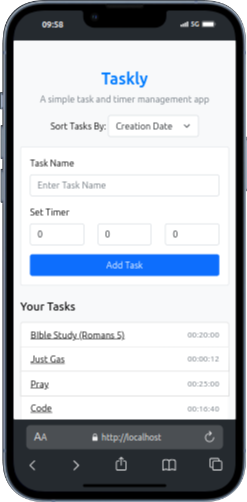

Here's a comprehensive `README.md` file for your Taskly project:

---

# **Taskly**

**Taskly** is a lightweight and user-friendly web-based task and timer management application. Designed for simplicity and functionality, it helps users organize tasks with timer functionality to track their progress. Built using PHP and MySQL, it leverages modern web technologies for an intuitive user experience.

---

## **Features**

- **Add Tasks:** Create tasks with customizable timers (hours, minutes, seconds).
- **Timer Management:** Start, pause, reset, and track timers for individual tasks.
- **Task List:** View and manage all tasks with options to delete tasks.
- **Alerts:** Sound notifications when timers expire.
- **Responsive Design:** Works seamlessly on desktops, tablets, and mobile devices.
- **Dark Mode (Optional):** Enhances usability in low-light conditions.

---

## **Tech Stack**

- **Frontend:** 
  - HTML5, CSS3, JavaScript
  - Bootstrap 5 for responsive design
- **Backend:** 
  - PHP 8.1 for server-side logic
- **Database:** 
  - MySQL for task data storage
- **Additional Tools:**
  - Apache (via XAMPP) for local hosting
  - FontAwesome for icons

---

## **Screenshots**

### **Home Page - Task List**


### **View Task - Timer Page**


---

## **How to Set Up**

### **Prerequisites**
- PHP 8.1 or later
- MySQL database
- Apache server (or equivalent)

### **Installation Steps**
1. Clone this repository:
   ```bash
   git clone https://github.com/yourusername/taskly.git
   ```
2. Move into the project directory:
   ```bash
   cd taskly
   ```
3. Set up the database:
   - Import the provided SQL file (`taskly.sql`) into your MySQL server.
4. Update database credentials in `db.php`:
   ```php
   $host = "localhost";
   $dbname = "taskly";
   $username = "your_username";
   $password = "your_password";
   ```
5. Start the server (e.g., using XAMPP or a PHP development server):
   ```bash
   php -S localhost:8000
   ```
6. Access Taskly in your browser at [http://localhost:8000](http://localhost:8000).

---

## **Potential Improvements**

This project is open to enhancement. Possible improvements include:
- Adding categories for tasks.
- Implementing user authentication for multiple users.
- Supporting recurring tasks or reminders.
- Introducing progress tracking or task completion stats.
- Enhancing the UI with advanced CSS frameworks.

---

## **Contribution**

Contributions are welcome! Feel free to fork the repository and create pull requests.

---

## **License**

This project is licensed under the [MIT License](LICENSE).

---

Let me know if you'd like to refine anything else, or I can help with deployment steps!